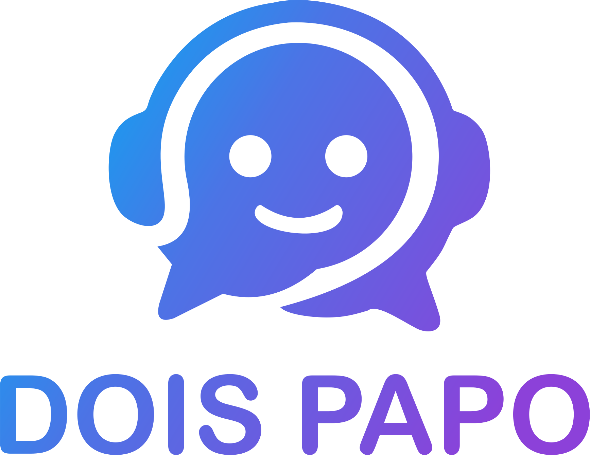

<div align="center">
  

  **Plataforma de comunicação self-hosted — texto, voz e compartilhamento de tela.**

  [chat.doispapo.com](https://chat.doispapo.com) · desenvolvido por [kaueramone.dev](https://kaueramone.dev)
</div>

---

## O que é

Dois Papo é uma plataforma de comunicação em comunidade, hospedada em
infraestrutura própria. Servidores, canais de texto, chamadas de voz e
transmissão de tela em 1080p — sem depender de plataforma de terceiros e sem
que as conversas passem por serviço alheio.

A instância é **fechada por convite**: o cadastro exige um código gerado pela
administração. Não há registro aberto ao público.

### Recursos

- 💬 **Texto** — servidores, canais, respostas, reações, anexos e emojis
- 🎙️ **Voz** — canais de voz com supressão de ruído
- 🖥️ **Tela** — compartilhamento em até 1920×1080
- 📎 **Arquivos** — upload com armazenamento próprio
- 🔔 **Notificações** — push no navegador
- 🔒 **Invite-only** — sem cadastro aberto

---

## Arquitetura

Toda a stack roda em containers numa única VPS, atrás de um proxy reverso com
TLS automático.

```
                    Internet
                       │
              ┌────────┴────────┐
              │  Caddy (80/443) │  TLS automático (Let's Encrypt)
              └────────┬────────┘
                       │
   ┌───────────┬───────┼────────┬────────────┬───────────┐
   │           │       │        │            │           │
 cliente      API   eventos  arquivos   metadados     GIFs
  web                 (ws)                proxy
   │           │       │        │            │           │
   └───────────┴───────┼────────┴────────────┴───────────┘
                       │
        ┌──────────────┼──────────────┬─────────────┐
        │              │              │             │
    MongoDB        Valkey        RabbitMQ        MinIO
    (dados)      (kv/pubsub)     (broker)      (arquivos)

              LiveKit  ──  7881/tcp + 50000-50100/udp
              (voz e vídeo, tráfego direto, fora do proxy)
```

**Serviços internos não têm porta publicada.** Banco, cache, broker e storage
existem apenas na rede interna dos containers — não são alcançáveis da
internet. Apenas o proxy (80/443) e o servidor de mídia (RTC) escutam
externamente.

---

## Como subir

Requisitos: Docker com plugin Compose, um domínio com registro A apontando
para a máquina, e as portas 80, 443, 7881/tcp e 50000-50100/udp liberadas.

```bash
git clone git@github.com:kaueramone/doispapo.git
cd doispapo/deploy

# gera configuração e segredos para o seu domínio
./generate_config.sh chat.seudominio.com

# sobe a stack
docker compose up -d
```

O `generate_config.sh` pergunta duas coisas:

| Pergunta | Resposta | Motivo |
|---|---|---|
| Reverse proxy externo? | **n** | O Caddy embutido já termina o TLS |
| Câmera e tela? | **Y** | Habilita vídeo e define 1080p |

Depois, deixe a instância fechada adicionando ao fim do `Revolt.toml` gerado:

```toml
[api.registration]
invite_only = true
```

E crie o primeiro convite — **é obrigatório**, o registro é bloqueado inclusive
para o administrador:

```bash
CODE=$(openssl rand -hex 8)
docker compose exec -T database mongosh --quiet revolt \
  --eval "db.account_invites.insertOne({ _id: \"$CODE\" })"
echo "Convite: $CODE"
```

> ⚠️ O DNS **não pode** estar atrás de proxy/CDN. WebRTC usa UDP, que
> proxies HTTP não encaminham — voz e tela quebram. Na Cloudflare, o registro
> precisa ficar em "DNS only" (nuvem cinza).

---

## Operação

Comandos do dia a dia, backup, atualização e diagnóstico estão em
[`CLAUDE.md`](CLAUDE.md).

## Identidade visual

Logos e cores da marca em [`assets/logos/`](assets/logos/).
Azul `#2E8BEB` · Roxo `#8C41D9`.

---

## Licença

Distribuído sob a **GNU Affero General Public License v3.0** — veja
[`LICENSE`](LICENSE). Créditos de origem em [`NOTICE`](NOTICE).
